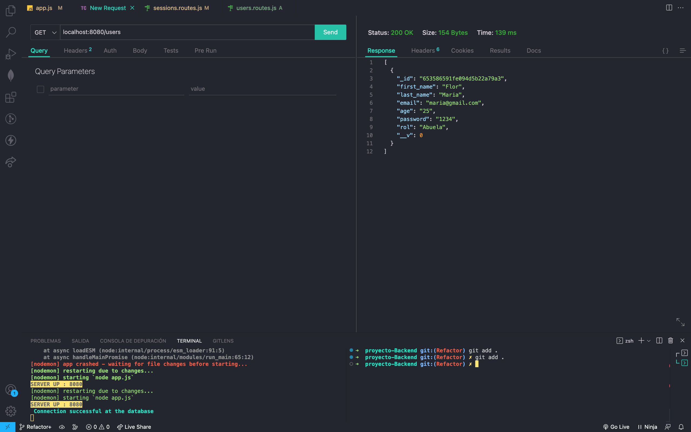
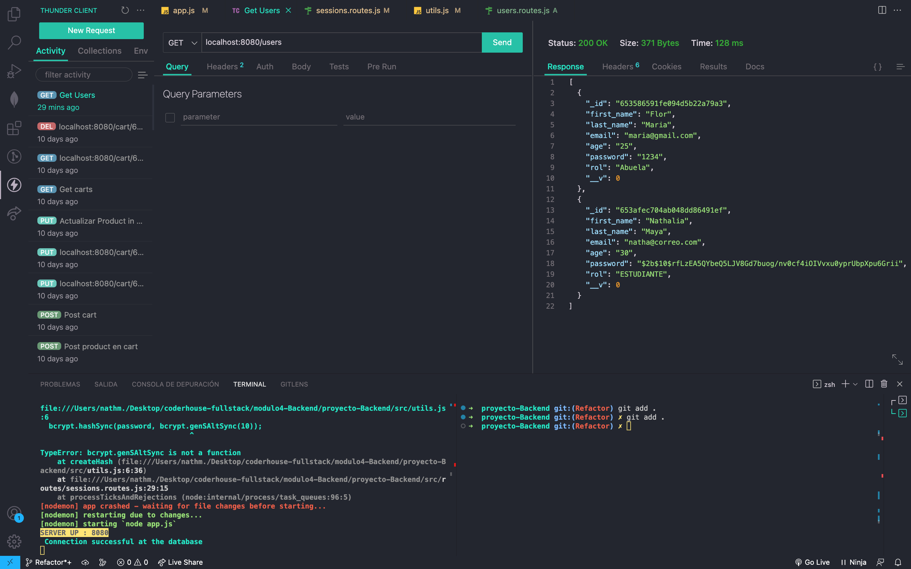

## REFACTOR DEL LOGIN

- Se deberá contar con un hasheo de contraseña utilizando bcrypt   

   - **Password sin hash**

   - **Password con hash** : Ver el segundo usuario ingresado luego de aplicar el hash con bcrypt en el password.

- Se deberá contar con una implementación de passport, tanto para register como para login.
- Implementar el método de autenticación de Github a la vista de login.

Conceptos aplicados ✅